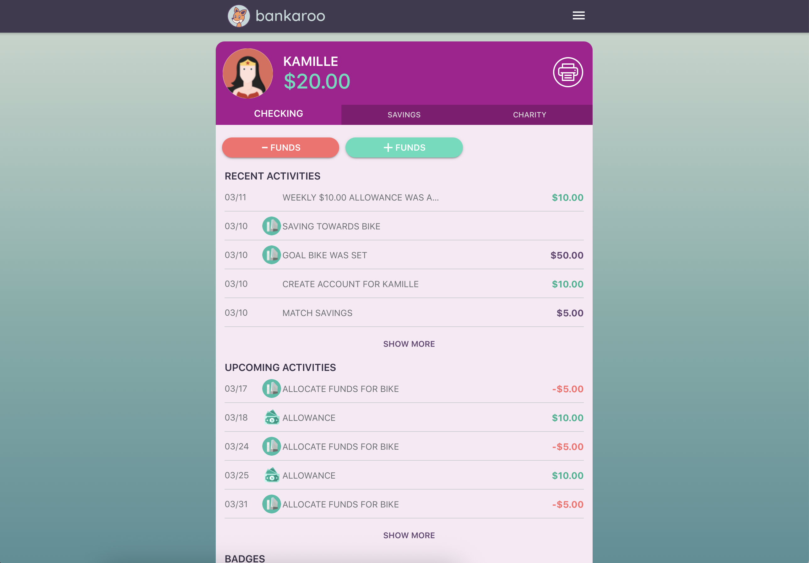
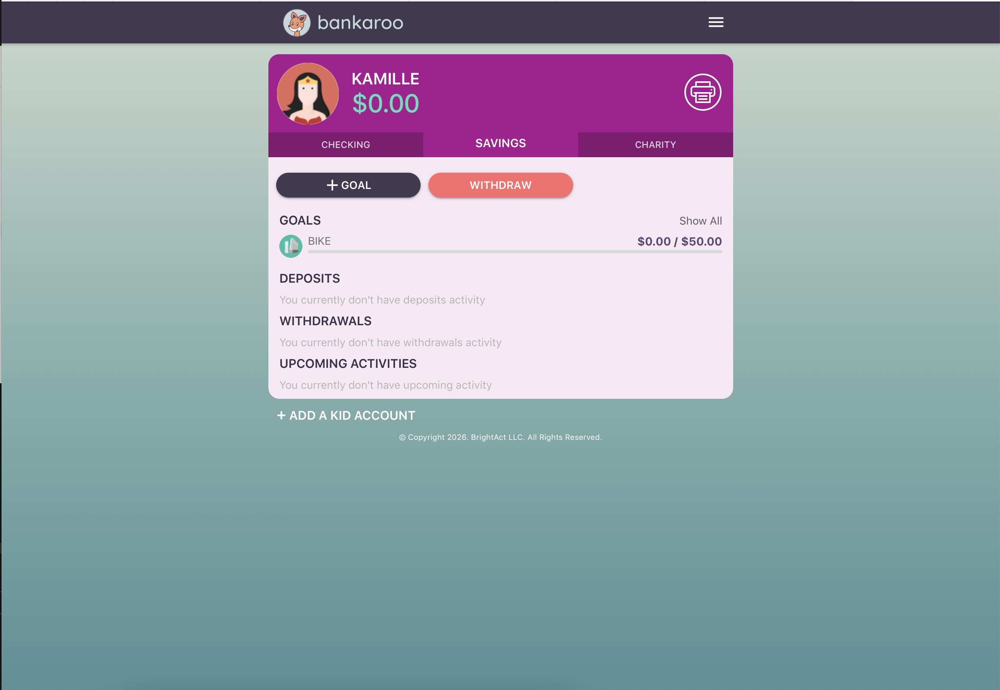

::: {.hero-banner}

# Bankaroo &#10038;

Kids Financial Literacy App

:::

## Overview

**Bankaroo** is a kids' financial literacy app that turns parents into a simulated bank. Parents create accounts for their children, set savings goals, configure allowances, and model real financial behaviors — all inside an app the whole family uses together.

The product is built on an existing Ionic/Angular codebase with Capacitor for native mobile deployment. The Sprint 3 MVP focuses on the core action: a parent adds funds to a child's account and sees the balance update in real time.

## Core MVP Feature &#10038;

> A parent adds funds to a child's account and sees the balance update.

This single action is the foundation of the entire product — it establishes the parent-as-bank mental model and makes the value proposition tangible for both parent and child.

## Live Product &#10038;

  <a class="btn btn-primary d-inline-flex align-items-center"
     href="https://bankaroo-zeta.vercel.app/"
     target="_blank" rel="noopener"
     aria-label="Open live app">
    <i class="fa-solid fa-window-restore me-2" aria-hidden="true"></i>
    Open App in New Tab
  </a>

  <a class="btn btn-outline-dark d-inline-flex align-items-center"
     href="https://github.com/jordanfaust15/bankaroo"
     target="_blank" rel="noopener"
     aria-label="Open GitHub source">
    <i class="fa-brands fa-github me-2" aria-hidden="true"></i>
    View source on GitHub
  </a>

  <a class="btn btn-outline-secondary d-inline-flex align-items-center"
     href="https://github.com/jordanfaust15/bankaroo/blob/bankaroo-ionic/PRODUCT_SPEC.md"
     target="_blank" rel="noopener"
     aria-label="View product spec">
    <i class="fa-solid fa-file-lines me-2" aria-hidden="true"></i>
    Product Spec
  </a>

<iframe src="https://bankaroo-zeta.vercel.app/"
        style="width:100%; height:900px; border:none; border-radius:12px;"
        allowfullscreen>
</iframe>

## Screenshots &#10038;

::: {layout-ncol=2}

:::

## Key Features &#10038;

- **Child Account Management**: Parents create and manage accounts for each child
- **Fund Transfers**: Add and withdraw funds with real-time balance updates
- **Savings Goals**: Children set goals; parents can match contributions
- **Allowance Scheduling**: Automate recurring deposits with configurable frequency
- **Interest Simulation**: Model real saving concepts with configurable interest rates
- **Permission Controls**: Parents decide what children can do independently
- **Activity Feed**: Transaction and goal history in a unified timeline
- **Badge System**: Milestone rewards to encourage saving behaviors
- **Profile Photos**: Personalized child accounts with camera integration

## Platform Strategy

**Decision: Capacitor** (migrated from Cordova)

Bankaroo is mobile-first by design. Kids — the primary learners — need quick access away from a computer: at a store deciding whether to spend, earning money from chores, or checking progress toward a savings goal. Core user flows (check balance, log a transaction, view goals) are all under 30 seconds.

| Factor | Assessment |
|--------|-----------|
| Away from computer? | Yes — kids are mobile-first |
| Device hardware needed? | Lightly — camera for profile photos, social sharing |
| Core flow < 30 seconds? | Yes — all key interactions |
| Competitor apps? | Yes — Greenlight, FamZoo, GoHenry all in App Store |
| App store as trust signal? | Critical — parents vet tools they hand to children |

Capacitor is the natural migration from the existing Cordova stack: it preserves app store distribution, reuses the Ionic/Angular codebase, and modernizes the native bridge without a full rewrite.

## Technical Details

**Framework/Stack:** Ionic 7, Angular, Capacitor

**Deployment:** Vercel (web), iOS App Store, Amazon Appstore (native)

**Tools Used:**

- Claude Code for development assistance
- Firebase for backend/auth
- Capacitor for native mobile bridge
- Cordova plugins for camera and social sharing

## Product Spec

Full specification available on GitHub:
[**PRODUCT_SPEC.md**](https://github.com/jordanfaust15/bankaroo/blob/bankaroo-ionic/PRODUCT_SPEC.md){target="_blank"}

Key sections include:

- Problem statement and target users (parents of children ages 6–16)
- Core feature definitions with acceptance criteria
- Technical architecture and deployment strategy
- Platform decision rationale (Capacitor vs. PWA vs. React Native)

---

## User Testing Summary &#10038;

**Testing period:** March 10, 2026 | **Testers:** 3 participants | **Task:** Create a child account and add $10

### Overall Findings

All three testers completed the core task successfully in under five minutes. However, a consistent theme emerged across every session: **the "parent as bank" mental model is never established by the UI**, causing significant early confusion. Once testers understood that they were acting as both parent *and* bank — setting the rules for a simulated financial institution — downstream features like match savings, interest, and permissions became interpretable. But that understanding required facilitator intervention rather than the product doing the work.

Secondary features (match savings, interest, badges, activity feed) generated the most friction and the most unsolicited feedback, pointing to a gap between feature richness and feature clarity.

### Issues by Severity

**Critical**

- *"Parent as bank" mental model never established* — All three testers were confused about their role before starting. Without this framing, nearly every advanced feature is uninterpretable.
- *"Match savings" is deeply unclear* — Every tester flagged this. None understood who is doing the matching, at what rate, or why it exists. Comparisons to Roth IRAs and ROI came up unprompted.
- *Fund permission toggles are ambiguous* — Testers couldn't tell if "Can add funds / Can withdraw funds" applied to the parent or the child.

**Major**

- Interest feature lacks explanation — who accrues it, who pays it, and why a parent would set it
- Name vs. username field confusion — violates the familiar first/last name pattern users expect
- Activity feed mixes goals and transactions with no visual distinction — a parent could misread a "+$1,000 goal" as a real deposit
- No inline editing — the only editing path (three-dot menu → "Edit kid's account") was hard to discover

**Minor**

- Summary screen described as "a little disorganized" — card-based layout suggested
- Badge system is opaque — no explanation of how badges are earned or what comes next
- No end date option for recurring allowances

### Patterns Across Testers

| Pattern | Sessions |
|---------|----------|
| Confusion about "match savings" | 3 of 3 |
| Needed explanation of "parent as bank" | 3 of 3 |
| Unclear whether permissions apply to parent or child | 2 of 3 |
| Interest feature not understood | 2 of 3 |
| Wanted to see child's view to verify understanding | 2 of 3 |
| Terminology felt too adult/financial | 2 of 3 |
| Wanted inline editing | 2 of 3 |

### Key Quotes

> *"I thought I was a parent."* — Tester 1, on learning they were also acting as the bank

> *"I feel like some of the explanations, like while you're setting it up, should be more clear… it's a little bit confusing being the parent."* — Tester 1

> *"Allow child to add funds, allow child to withdraw funds — I think this is honestly the first time I understood it that way too."* — Tester 2, suggesting clearer label language

> *"It says name, but the second one is the username, it's not the last name."* — Tester 3, on account creation form

> *"There's no difference here [between goals and transactions]. Like, what if I'm just colorblind?"* — Tester 3, on the activity feed

> *"Where are my badges? I don't even know why I got these, or how I could get more — what should I be striving for?"* — Tester 3, on the badge system

### Top 3 Prioritized Changes

**#1 — Establish the "parent as bank" mental model at onboarding**

Every tester needed a facilitator to explain this mid-session. A brief, plain-language explainer before account setup (e.g., *"You're setting up a pretend bank for your child. You set the rules."*) would resolve or reduce confusion across multiple downstream issues. This is the single biggest onboarding failure point.

**#2 — Rewrite "match savings" and fund permission labels**

These generated the most consistent confusion across all three sessions and are core to the product's value proposition. "Match savings" should make the actor explicit: *"I'll match every $1 my child saves with $___."* Permission toggles should read *"Allow my child to deposit funds"* and *"Allow my child to withdraw funds."* High-impact copy changes with low implementation cost.

**#3 — Separate goals and transactions in the activity feed**

Visually conflating goal milestones with real transactions is a trust issue — a parent misreading a "+$1,000" goal entry as a real deposit erodes product confidence. Two distinct sections ("Recent Transactions" vs. "Account Activity") directly addresses this feedback and improves scannability for all users.

---

**Skills Demonstrated:** Mobile Product Management, User Testing, Ionic/Angular, Capacitor, Firebase, Usability Synthesis

**Tools Used:** Claude Code, Ionic, Angular, Capacitor, Firebase, Vercel
